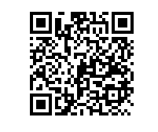

# 用途
* 将收集到的学生及家长（同住人）的的核酸检测报告及行程码通过OCR图像识别，自动识别收集到的图片，自动对比，然后已醒目的方式呈现出来，节省班主任老师的时间。
* 本程序多数代码都是从网上搜索得到，感谢各路大神的分享。
## 初衷
孩子学校所在地区，每3天需要收集学生及同住人的三天一检的核酸检测信息。
一个班级50+的学生，加上平均同住人2.5个人，也要收集大概300+的图片。
这些图片需要班主任一个个核对，就需要占用至少两个小时。
为了减轻班主任工作，在原作者基础上修改适合本地班级使用。
班主任只需要在收集完成后，执行检查，等待结果即可。
## 前提
* 已设计好石墨表单，收集后生成Excel表格。
* 表格样本见xxx-20220407-20220410.xlsx，可根据这个表格设计表单。
* 表单示例

  

## 限制条件
* 只针对粤核酸的核酸检测及通信行程卡
* 不同手机不同分辨率的截图也会对本程序的字串处理有些影响
* 本程序不保证准确率
# OCR识别的运行环境准备
https://github.com/PaddlePaddle/PaddleOCR/blob/release/2.4/doc/doc_ch/environment.md

# 工作流程
1. 识别文件名，文件名格式是xxx-20220407-20220410.xlsx，两个日期范围是必须的
2. 将xlsx重命名为.zip，然后获得图像所在文件夹以及每一行图片对应的路径
3. 针对每一行信息，逐个图片识别
4. 汇总到一张新的表格里面，方便查看。

# 更佳解决方案探讨
* 搭建后台，家长上传资料，实时OCR识别审核。
* 卫健委开放查询API给教育局，家长授权教育局查询，班主任只需要拉取数据即可。希望这种方式能够尽快实现，这样不要占用老师的时间，老师有更多时间来做教育工作！
# 环境问题
## ImportError: DLL load failed while importing win32file: 找不到指定的模块
需要在Pycharm执行配置中添加一行配置：CONDA_DLL_SEARCH_MODIFICATION_ENABLE=1
